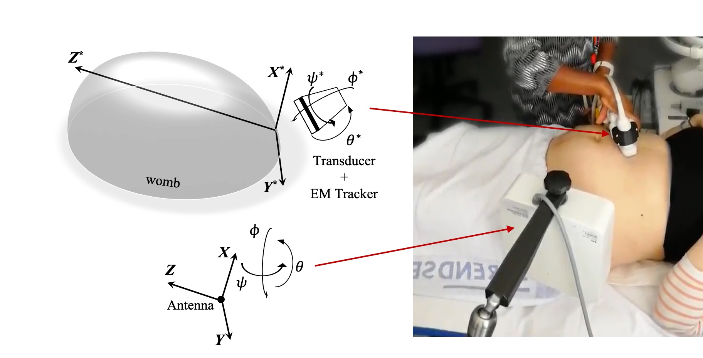
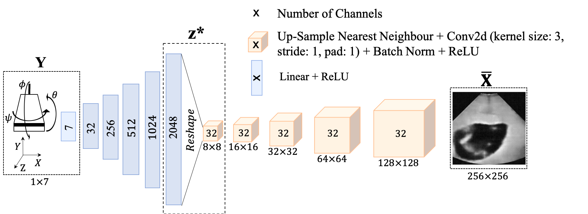
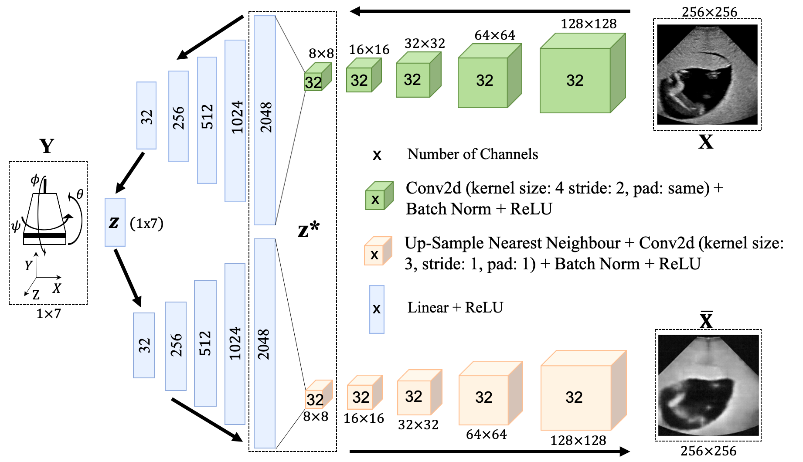

# Deep Generative Gentworks for Patient Specific Ultrasound Simulation

This was my BEng project thesis work.<br><br>

## Summary
The project consisted in the development of a patient specific ultrasound (US) simulator, which takes as an input the US transducer coordinates (&X;, &Y;, &Z;) and inclination (&phi;, &theta;, &psi;) and outputs the corresponding 2D US slice with a resolution of 256x256 pixels. The project introduces a novel framework for US simulation and we successfully proved the validity of our method, for more info see the published paper: https://link.springer.com/chapter/10.1007%2F978-3-030-52791-4_33 <br>

This work will allow better clinician training to reduce the high variance of fetal US diagnosis, which is one of the leading causes of prenatal death. Furthermore, the fact that the method is patient specific, meaning that all training data comes from the same patient, allows for retrospective analysis of complex anomalies and rare illnessness. These are currently only spotted in a clinical setting, leading to the clinician expertise being highly dependent on the repertoire of cases they saw throughout their career, explaining the high variance in prenatal diagnosis.<br>

The current outcome of this project (unpublished repository, waiting for journal publication approval) uses generative adversarial networks (GANs) coupled with a perpceptual loss function (LPIPS) to achieve the below simulated trajectory. As you can note the sequence is quite jumpy, this is because no time correlation was taken into account up to now, future work will incorporate time information by integrating the current models with an LSTM or transformer to get smoother trajectories. Current results are only using a one to one mapping between tracker information and output image, disregarding all the time relationships between successive frames.

<animation align="center">
    
    <figcaption>left: arbitrary US phantom trajectory. right: simulation.</figcaption>
</animation>

**Dataset** <br><br>
Data consisted of tracked US images using an EM tracker, both for a phantom and real patient images. The image belows better explanes the way we collected data.

<center>

</center><br>

**Models**<br><br>
Three main architectures were exprored, which are summarized in the diagrams below.<br>
The first one was a simple decoder which maps the input 7D tensor (X,Y,Z coordinates + inclination angles transformed to a 4D quaternion) through a series of linear and convolutional layers, trained via MSE minimisation between the output and GT images. The second one is an autoencoder, which mirrors the decoder to obtain an encoder-decoder architecture, trained via MSE on both the images and the 7D latent latemt space. The last trained architecture was a VAE, which introduces a stochastic sampling of the latent variable allowing the model for better generalisation.
<center>

</center><br>



## Installation

Clone this repository to your local machine as:

```bash
git clone git@gitlab.com:cesare.magnetti/BEng_project.git
```

You will also need to install specific python packages:

```bash
pip install -r requirements.txt
```

## Usage

unfortunately this project was not optimized for user experience, therefore if you want to play around with it you will need to do quite some changes to the code, specifically you will want to change these files: ```./scripts/train_decore.py``` ```./scripts/train_autoencoder.py``` ```./scripts/train_variational.py```. Additionally, due to patient regulations, I do not have permission to upload the data used for training, so there will be little for you to experiment with, other than inspecting the code.

## Acknowledgements
I would like to thank my supervisors Prof. Julia Schnabel <mailto:julia.schnabel@kcl.ac.uk> and Dr. Alberto Gomez <mailto:alberto.gomez@kcl.ac.uk>

## Contributing
@cesare.magnetti

