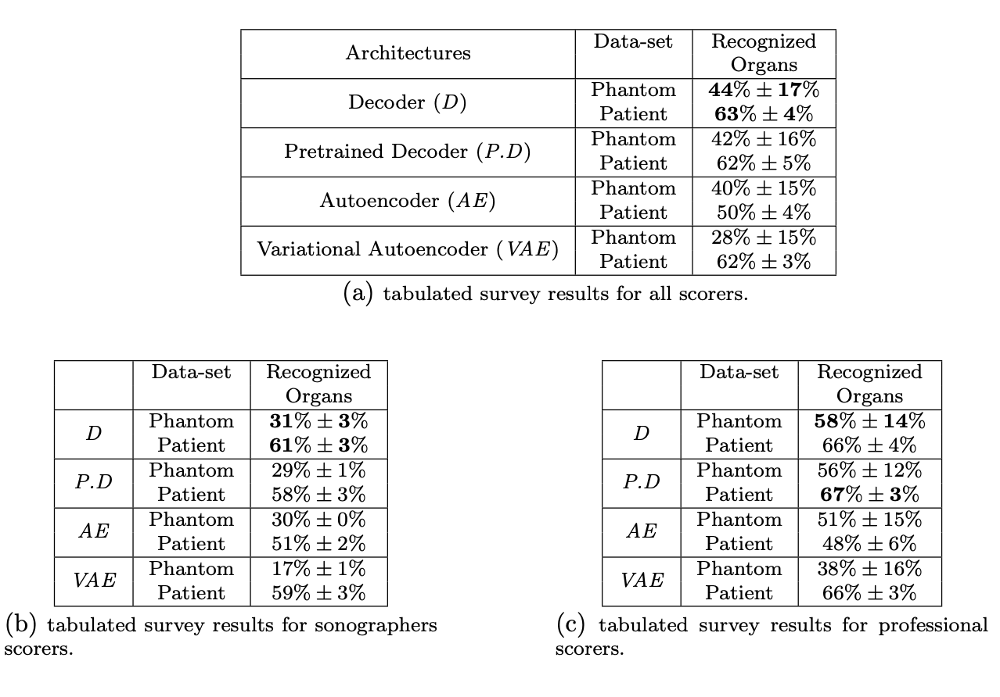
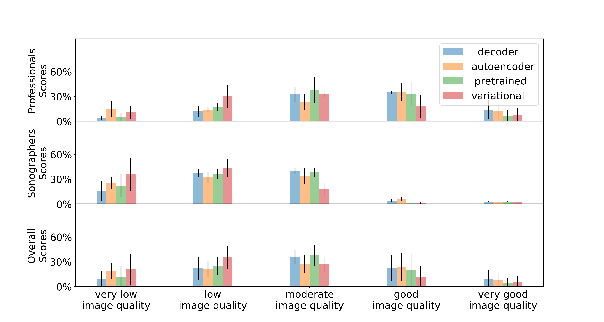
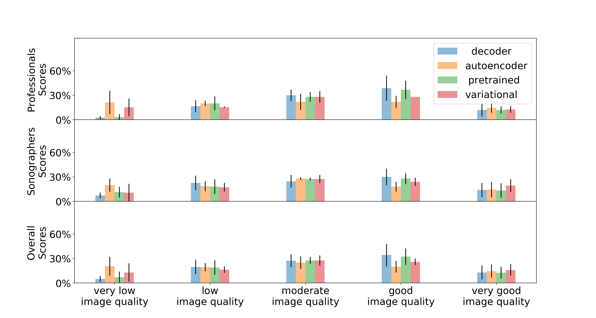
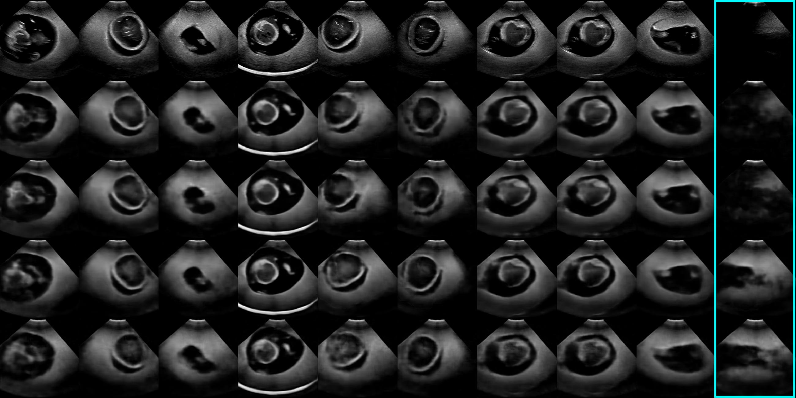
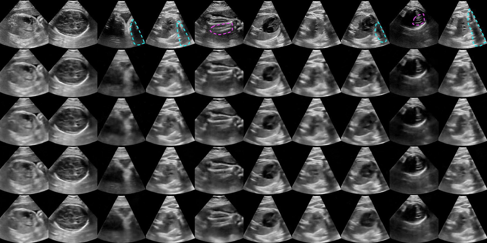
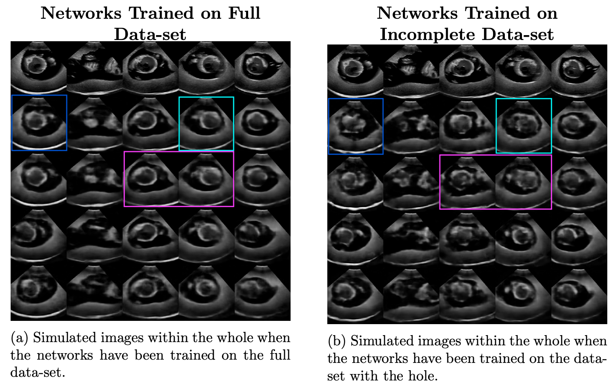

# Deep Generative Gentworks for Patient Specific Ultrasound Simulation

This was my BEng project thesis work.<br><br>

## Summary
The project consisted in the development of a patient specific ultrasound (US) simulator, which takes as an input the US transducer coordinates (&X;, &Y;, &Z;) and inclination (&phi;, &theta;, &psi;) and outputs the corresponding 2D US slice with a resolution of 256x256 pixels. The project introduces a novel framework for US simulation and we successfully proved the validity of our method. 
For more info see the published paper: https://link.springer.com/chapter/10.1007%2F978-3-030-52791-4_33 <br>
Or download the PDF dissertation contained in the repo.

This work will allow better clinician training to reduce the high variance of fetal US diagnosis, which is one of the leading causes of prenatal death. Furthermore, the fact that the method is patient specific, meaning that all training data comes from the same patient, allows for retrospective analysis of complex anomalies and rare illnessness. These are currently only spotted in a clinical setting, leading to the clinician expertise being highly dependent on the repertoire of cases they saw throughout their career, explaining the high variance in prenatal diagnosis.<br>

The current outcome of this project (unpublished repository, waiting for journal publication approval) uses generative adversarial networks (GANs) coupled with a perpceptual loss function (LPIPS) to achieve the below simulated trajectory. As you can note the sequence is quite jumpy, this is because no time correlation was taken into account up to now, future work will incorporate time information by integrating the current models with an LSTM or transformer to get smoother trajectories. Current results are only using a one to one mapping between tracker information and output image, disregarding all the time relationships between successive frames.

<div align="center">
    <br>
	Fig 1: on the left we have the original trajectory, on the right we have the simulated<br>
	trajectory which takes the US probe coordinates and inclination as an input. This state<br>
	of results is sill in an unpublished repository, waiting for journal publication approval. <br>
</div>

## Dataset
Data consisted of tracked US images using an EM tracker. We let professional sonographers perform regular fetal ecographies both on real patients and a synthetic phantom. The image belows better explanes the way we collected data.

<div align="center">
    <br>
	Fig 2: Diagram showing the method we adopted to label the US images with their tracked location.
</div><br><br>

**Models**<br><br>
Three main architectures were exprored, which are summarized in the diagrams below. The first one was a simple decoder which maps the input 7D tensor (X,Y,Z coordinates + inclination angles transformed to a 4D quaternion) through a series of linear and convolutional layers, trained via MSE minimisation between the output and GT images. The second one is an autoencoder, which mirrors the decoder to obtain an encoder-decoder architecture, trained via MSE on both the images and the 7D latent latemt space. The last trained architecture was a VAE, which introduces a stochastic sampling of the latent variable allowing the model for better generalisation.
<div align="center" witdh="50%">
	Fig 3: Diagram showing the decoder architecture.<br>
		
</div><br>

<div align="left" witdh="50%">
	Fig 4: Diagram showing the autoencoder architecture.
</div>
<div align="right" witdh="50%">
	Fig 5: Diagram showing the variational autoencoder architecture.
</div>
<br>


## Experiments & results

Two main types of experiments were conducted:

1. Achieved image quality was measured both quantitatively and qualitatively through user rated surveys and image similarity algorithms. Survey scorers comprised of a cohort of expert sonographers and computational imaging professionals in the field of fetal ultrasound imaging.
2. Interpolation capabilities were assessed by removing part of the training data in a specific location and measuring the relative drop in performance when inferring samples within the removed region.

The experiments pointed to the decoder being the arcitecture that achieved the lowest absolute error and the top image quality (closely followed by the variational autoencoder for real patient images). This can be explained by the fact that the decoder is the only architecture that directly optimizes the mapping from tracked coordinates to US images, wheras the other two architectures optimize the mapping from original image to simulated image. The variational autoencoder however proved to have stronger interpolating abilities, yielding a lower relative drop in performance within the deleted region and simulating higher quality images in this region. Future work aimed at improving image quality using GAN, while retaining image content (we do not want high quality samples showing the wrong structures). The figures below illustrate the results we discussed.

<div align="center" witdh="70%">
	<br>
	Table 1: Tabulated results of the survey experiments on each architecture, both phantom and real-patient<br>
	results are reported for each table. a): overall results of the survey. b)&c): itra-observer analysis between<br>
	results of sonographers and computational imaging professionals. Note that results vary by a significant degree <br>
	between b) and c), indicating the different abilities of each scorer at particular tasks. Scorers were asked to <br>
	indicate if they could recognise the organs or structures contained in the simulated images. Each tabulated result <br>
	is reported as mean±standard deviation to emphasize the variability between scorers and the best scores are<br>
	highlighted in bold. Note that results are significantly better for real-patient data.<br>
</div><br><br>


<br>
Fig. 6: Diagrams reporting the results for the phantom survey (left) and patient survey (right). Scorers rated each simulated image on a 5 point scale (range 0-4) scale ranging from very low image quality to very good image quality. Each diagram reports the ratings of each architecture as mean ± standard deviation between scorers, where the latter is represented as a vertical error bar. It is evident that sonographers generally rated the images to have lower quality respect to imaging professionals. This discrepancy is not taken as a weakness of the test but, on the other hand, it will be used to assess the simulators for their different purposes which may be better judged by either category. Again, note the significantly better performance of the models on real-patient data.<br><br>


<br><br>
Fig. 7: Ten examples of simulated phantom (top) and real-patient (bottom) images for each architecture, using tracking data from the test set. The top row shows the original images, and the rows 2, 3, 4 and 5 show the simulations using the Decoder, Pre-trained Decoder, Autoencoder and the Variational Autoencoder respectively. Shadowing and reverberation artifacts are highlighted respectively with light blue and pink dashed contour lines for the original images (top row) to allow comparison of such artifacts with the simulated images. The highlighted column in the phantom image shows an example where autoencoders tend to produce wrong high quality images, possibly due to over-fitting.<br><br>


<br>
Fig. 8: Diagrams reporting five illustrative examples of simulated phantom images from tracking data coming from the test set. On the lest we show results of the networks trained on the full dataset and on the right the same networks trained on the dataset after removing a specific region of data. For each diagram the top row contains the original images, the second row contains images simulated by the Decoder, the third row contains images simulated by the Pretrained Decoder architecture, the fourth row contains images simulated by the Autoencoder architecture and bottom row contains images simulated by the Variational Autoencoder architecture. All views have been sampled from the region removed from the data, allowing to visualize the drop in image quality, the variational autoencoder seems to suffer the least.<br><br>


## Installation

Clone this repository to your local machine as:

```bash
git clone git@gitlab.com:cesare.magnetti/BEng_project.git
```

You will also need to install specific python packages:

```bash
pip install -r requirements.txt
```

## Usage

unfortunately this project was not optimized for user experience, therefore if you want to play around with it you will need to do quite some changes to the code, specifically you will want to change these files: ```./scripts/train_decore.py``` ```./scripts/train_autoencoder.py``` ```./scripts/train_variational.py```. Additionally, due to patient regulations, I do not have permission to upload the data used for training, so there will be little for you to experiment with, other than inspecting the code.

## Acknowledgements
I would like to thank my supervisors Prof. Julia Schnabel <mailto:julia.schnabel@kcl.ac.uk> and Dr. Alberto Gomez <mailto:alberto.gomez@kcl.ac.uk>

## Contributing
@cesare.magnetti

